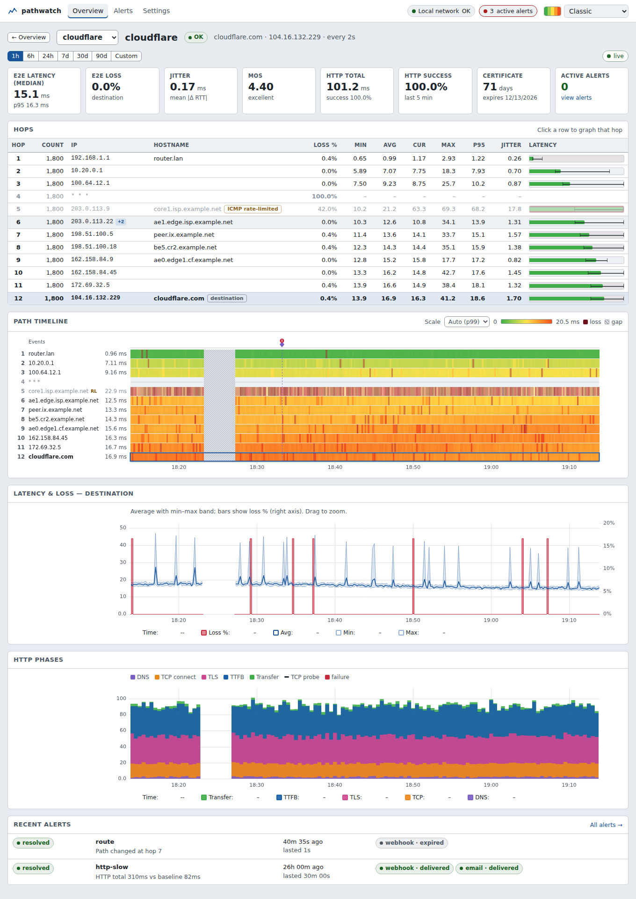
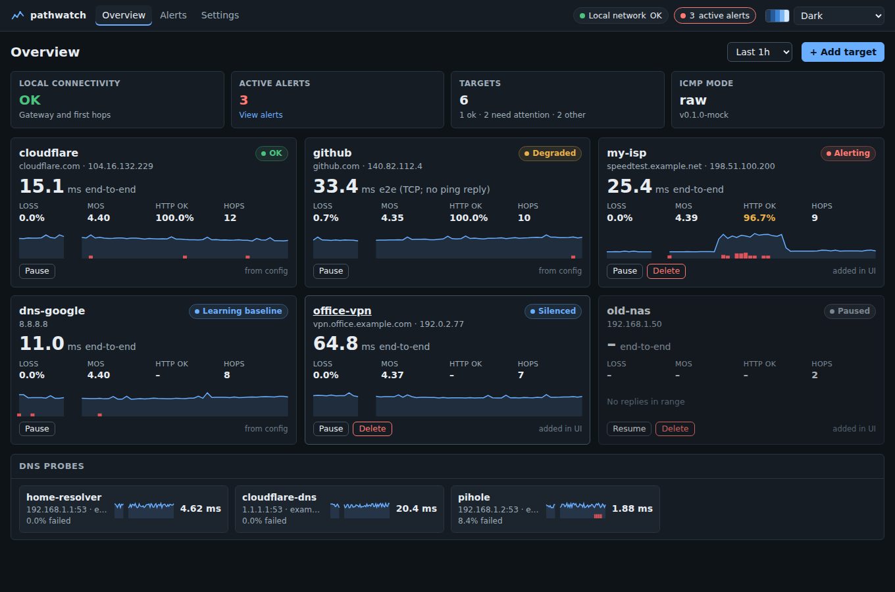

# pathwatch

A self-hosted network analysis tool that continuously monitors the path to the destinations you care about. It records per-hop latency and loss alongside real HTTP/HTTPS, TCP and DNS timing, so you can tell "a router is rate-limiting my pings" from "my connection is actually broken". Its feature set is comparable to commercial path-analysis and network-monitoring products, but it ships as a single static binary with an embedded web dashboard, plus a multi-arch Docker image for servers and NAS devices such as Synology.

## Goal

Give home labs, small networks and anyone troubleshooting flaky connectivity a free, always-on way to see where on the path a problem occurs, how long it has been happening, and whether it affects real traffic.

## Features

- **Hop-by-hop path analysis**: sent/lost, loss %, min/avg/max/current/p95 and jitter for every hop, with inline latency bars and hostname/ASN enrichment.
- **Path timeline**: a per-hop heatmap over time with route changes and monitor gaps marked, updated live.
- **End-to-end probes**: HTTP/HTTPS (DNS, connect, TLS, TTFB, transfer), TCP connect and DNS, correlated on the same time axis as the hops.
- **Rate-limit-aware alerting**: end-to-end probes decide; loss on an intermediate router alone never pages you. Hysteresis, cooldowns, silences, maintenance windows, and queued retries. Webhook (Discord, Slack, ntfy, generic) and email channels.
- **MOS score** per target from latency, jitter and loss.
- **Data export and ISP report**: download the selected range as CSV or JSON (per-hop or per-probe rollups), or open a printable report with availability, latency, MOS, incidents, the first degraded hop of each incident, probe impact, monitoring gaps and path changes.
- **Long-term history** in SQLite with automatic rollups and retention.
- **Configurable from the UI or YAML**: manage targets (hostname, IPv4, IPv6), intervals, thresholds and alert rules in the browser, or keep everything in a version-controlled file.
- **Themes**: nine built-in, including Dark, Nord, Solarized and a green/yellow/red Classic scale.
- **Pure Go, no CGO**: Linux (amd64, arm64, armv7) and Windows.

## Screenshots

Screenshots use demo data.

| Target page (Classic theme) | Overview (Dark theme) |
|---|---|
|  |  |

## Quick start (Docker)

```sh
docker run -d --name pathwatch \
  --network host \
  --cap-drop ALL --cap-add NET_RAW \
  --security-opt no-new-privileges:true \
  --read-only --tmpfs /tmp \
  --restart unless-stopped \
  -e TZ=Europe/London \
  -e PATHWATCH_PASSWORD='choose-a-long-password' \
  -v pathwatch-data:/data \
  ghcr.io/i-press-buttons/pathwatch:latest
```

Open <http://localhost:8095> and log in as `admin`. `--network host` makes probes follow your real traffic path, and `--cap-add NET_RAW` allows raw ICMP for hop tracing. The container runs as root but drops every other capability, cannot gain privileges, and has a read-only root filesystem; only `/data` is writable (see [Container hardening](#container-hardening)). If `PATHWATCH_PASSWORD` is omitted, a random one is saved to `/data/.pathwatch-password` and logged.

To build from source (Go 1.26, latest patch release recommended; no C toolchain): `go build ./cmd/pathwatch && ./pathwatch run --config pathwatch.yaml`. A one-shot trace is available with `pathwatch trace <host>`.

### Verifying downloads

Release archives and the Docker image carry build provenance attestations. Verify them with the `gh` CLI:

```sh
gh attestation verify pathwatch_X.Y.Z_linux_amd64.tar.gz --repo I-press-buttons/pathwatch
gh attestation verify oci://ghcr.io/i-press-buttons/pathwatch:X.Y.Z --repo I-press-buttons/pathwatch
```

### Container hardening

The image runs as root (raw ICMP sockets work most reliably that way on Synology kernels), so the examples confine that process: `--cap-drop ALL --cap-add NET_RAW` keeps the only capability pathwatch uses, `no-new-privileges` blocks privilege gain, and `--read-only` with a `/tmp` tmpfs leaves `/data` as the only writable path. The compose file and Portainer stack in `deploy/` use the same settings. To check: `docker exec pathwatch grep -E 'CapEff|NoNewPrivs' /proc/1/status` should show `0000000000002000` and `1`, and the log should contain `icmp_mode=raw`.

- **Data folder ownership.** Without `DAC_OVERRIDE`, root can only write to `/data` if the host folder is owned by root or is world-writable. A folder owned by another user (typical on Synology, where File Station creates folders owned by your DSM user) fails at startup with `write starter config: open /data/pathwatch.yaml: permission denied`. Fix it with `sudo chown root:root <data folder>`, or add `--cap-add DAC_OVERRIDE`. Existing installs whose files are already root-owned are not affected.
- **Log file location.** With `--read-only`, a `log.file` outside `/data` cannot be opened. pathwatch prints a warning and keeps logging to stderr (`docker logs`). A relative `log.file` resolves next to the config file, so it lands in `/data`.
- **Non-root (advanced, not the default).** You can run with `user: "<uid>:<gid>"`, but the image has no file capability on the binary, so a non-root process gets no effective `NET_RAW` and raw ICMP fails; it only works with unprivileged datagram ICMP where the host's `net.ipv4.ping_group_range` allows it (often not enabled on Synology). The data folder must be owned by that uid. If you build your own image with `setcap cap_net_raw+ep` on the binary, do not combine that with `no-new-privileges` unless you have verified it on your runtime: file capabilities can be ignored under `no_new_privs` depending on the Docker/runc version, and with `+ep` a container started without `NET_RAW` in its bounding set will refuse to execute the binary at all.
- `NET_RAW` on the host network also allows raw packet sockets on all host interfaces. That is inherent to raw ICMP mode.

## Security

- The web UI uses HTTP Basic auth. Over plain HTTP (the Docker default, `0.0.0.0:8095`) the password is sent in clear text with every request. Use it that way only on a network you trust, and do not forward port 8095 from the internet.
- For remote access use a VPN, an HTTPS reverse proxy (Caddy, Traefik, Synology's built-in reverse proxy), or built-in TLS (`tls.cert_file` / `tls.key_file`). With built-in TLS the image's plain-HTTP healthcheck fails; override `healthcheck:` in your compose file (for example `wget -q --no-check-certificate -O- https://127.0.0.1:8095/healthz`) or terminate TLS in a reverse proxy instead.
- Set `PATHWATCH_PASSWORD` yourself, and make it at least 12 characters (a shorter one logs a startup warning). A generated password is printed to the container log, where anyone with log access can read it, and stored in `/data/.pathwatch-password` (mode 0600).
- On a loopback bind (for example `PATHWATCH_LISTEN=127.0.0.1:8095` behind a reverse proxy on the same machine) authentication is off unless `PATHWATCH_PASSWORD` is set, so set it. While auth is off, requests whose `Host` header is not `localhost`, a loopback IP or the `public_url` host are rejected with `421` (DNS-rebinding protection). A local reverse proxy in front of an auth-less instance must therefore have its public hostname in `public_url`; `X-Forwarded-Host` is not trusted for this check.
- Every response carries `Content-Security-Policy` (including `frame-ancestors 'none'`), `X-Frame-Options: DENY`, `X-Content-Type-Options: nosniff` and `Referrer-Policy: no-referrer`, so the UI cannot be framed by another site. `Strict-Transport-Security` is sent only with built-in TLS.
- Failed login attempts are rate-limited per client IP (`429` with `Retry-After`) and logged at warn level as `authentication failed`, which fail2ban or similar can watch for. Behind a reverse proxy all clients may appear as the proxy's address, so limit access at the proxy too.
- State-changing API calls (POST/PUT/PATCH/DELETE) are refused when cross-site, and endpoints with a body require `Content-Type: application/json`. Behind a reverse proxy, set `public_url` so the origin check matches the public address.
- Webhook `body_template`s are not escaped automatically; see the template rules in [docs/SPEC.md](docs/SPEC.md#channels).

## Documentation

- [docs/SYNOLOGY.md](docs/SYNOLOGY.md): Synology + Portainer deployment
- [docs/SPEC.md](docs/SPEC.md): design and full configuration reference
- [docs/API.md](docs/API.md): JSON API used by the UI

pathwatch has no telemetry and only contacts the targets and notification endpoints you configure.

## License

[MIT](LICENSE)
